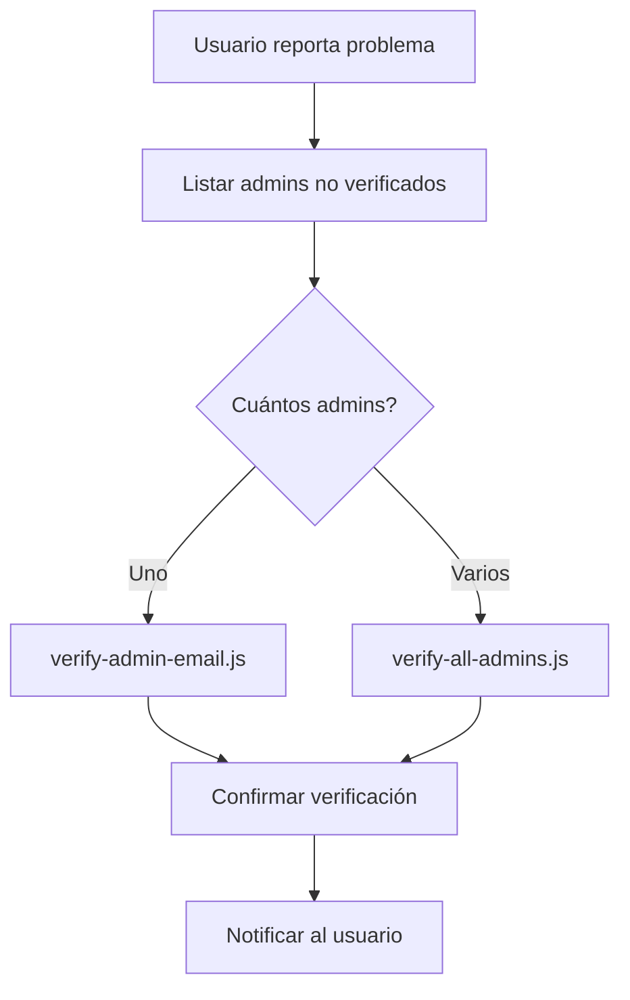

# 📧 Herramientas de Verificación Manual de Email - MediQueue

Este conjunto de herramientas te permite gestionar manualmente la verificación de email de administradores cuando el proceso automático falla en producción.

---

## 📋 Tabla de Contenidos

1. [Archivos Incluidos](#-archivos-incluidos)
2. [Información de Base de Datos](#-información-de-base-de-datos)
3. [Scripts Node.js](#-scripts-nodejs)
4. [Scripts SQL](#-scripts-sql)
5. [Guías de Uso](#-guías-de-uso)
6. [Solución de Problemas](#-solución-de-problemas)

---

## 📁 Archivos Incluidos

### Documentación
- `MANUAL_EMAIL_VERIFICATION_GUIDE.md` - Guía rápida de referencia
- `EMAIL_VERIFICATION_TROUBLESHOOTING.md` - Diagnóstico detallado del problema
- `MANUAL_VERIFICATION_README.md` - Este archivo

### Scripts SQL
- `manual-email-verification.sql` - Queries SQL completas

### Scripts Node.js
- `verify-admin-email.js` - Verificar un admin específico
- `list-admin-verification.js` - Listar todos los admins y su estado
- `verify-all-admins.js` - Verificar todos los admins de una vez

---

## 🗄️ Información de Base de Datos

### Tabla: `Administrador`

Los siguientes campos controlan la verificación de email:

| Campo | Tipo | Descripción | Valor Verificado | Valor No Verificado |
|-------|------|-------------|------------------|---------------------|
| `b_email_verified` | BOOLEAN | **Campo principal** | `TRUE` o `1` | `FALSE` o `0` |
| `s_verification_token` | VARCHAR(255) | Token único de verificación | `NULL` | Token UUID |
| `d_verification_token_expires` | DATETIME | Fecha de expiración | `NULL` | Fecha futura |

### Query Base para Verificar

```sql
UPDATE Administrador 
SET 
    b_email_verified = TRUE,
    s_verification_token = NULL,
    d_verification_token_expires = NULL,
    d_fecha_modificacion = NOW()
WHERE s_email = ?
```

---

## 🔧 Scripts Node.js

### 1. `verify-admin-email.js`

Verifica el email de un administrador específico.

**Uso:**
```bash
node verify-admin-email.js <email-del-admin>
```

**Ejemplo:**
```bash
node verify-admin-email.js admin@hospital.com
```

**Qué hace:**
1. ✅ Busca al administrador por email
2. ✅ Muestra información completa del admin
3. ✅ Verifica el email en la base de datos
4. ✅ Confirma que la operación fue exitosa

**Salida de Ejemplo:**
```
🔍 VERIFICACIÓN MANUAL DE EMAIL - MEDIQUEUE

════════════════════════════════════════════

1️⃣  Buscando administrador con email: admin@hospital.com...
✅ Administrador encontrado:
   → Nombre: Juan Pérez
   → Email: admin@hospital.com
   → UUID: a1b2c3d4-e5f6...
   → Estado: ACTIVO
   → Email Verificado: NO ❌

2️⃣  Procediendo con la verificación manual...
   → Filas afectadas: 1
   → Filas modificadas: 1

3️⃣  Verificando la actualización...
   → Email Verificado: SÍ ✅

✅ ¡ÉXITO! El email ha sido verificado correctamente.
```

---

### 2. `list-admin-verification.js`

Lista todos los administradores con su estado de verificación.

**Uso:**
```bash
# Listar todos
node list-admin-verification.js

# Solo verificados
node list-admin-verification.js --verified

# Solo no verificados
node list-admin-verification.js --unverified
```

**Qué hace:**
1. ✅ Muestra estadísticas generales
2. ✅ Lista detallada de cada administrador
3. ✅ Indica cuáles necesitan verificación
4. ✅ Sugiere comandos para verificar

**Salida de Ejemplo:**
```
📋 LISTA DE ADMINISTRADORES - ESTADO DE VERIFICACIÓN

═══════════════════════════════════════════════════════════

📊 Total de administradores: 3

─────────────────────────────────────────────────────────────────────

📈 Estadísticas:
   ✅ Verificados: 2
   ❌ No Verificados: 1
   🟢 Activos: 3

─────────────────────────────────────────────────────────────────────

1. ❌ 🟢 María García
   📧 Email: maria@hospital.com
   ...
   ⚠️  ACCIÓN REQUERIDA: Verificar email manualmente
   💡 Comando: node verify-admin-email.js maria@hospital.com

2. ✅ 🟢 Juan Pérez
   📧 Email: juan@hospital.com
   ...
```

---

### 3. `verify-all-admins.js`

Verifica TODOS los administradores no verificados de una sola vez.

**Uso:**
```bash
# Con confirmación
node verify-all-admins.js

# Sin confirmación (automático)
node verify-all-admins.js --force
```

**⚠️ PRECAUCIÓN:**
Este script verificará a **TODOS** los administradores pendientes. Úsalo solo si estás seguro.

**Qué hace:**
1. ✅ Lista todos los admins no verificados
2. ✅ Pide confirmación (a menos que uses `--force`)
3. ✅ Verifica todos de una vez
4. ✅ Muestra resultados y estadísticas

---

## 📝 Scripts SQL

### `manual-email-verification.sql`

Contiene todas las queries SQL necesarias organizadas en secciones:

1. **Consultar no verificados**
2. **Verificar por email**
3. **Verificar por UUID**
4. **Verificación masiva**
5. **Consultar estado**
6. **Generar nuevo token**
7. **Estadísticas**
8. **Limpiar tokens expirados**

**Uso:**
1. Conectarte a tu base de datos MySQL
2. Copiar la query que necesites
3. Reemplazar los valores de ejemplo
4. Ejecutar

---

## 📖 Guías de Uso

### Escenario 1: Verificar UN Administrador Específico

#### Opción A: Script Node.js (Recomendado)

```bash
# En el directorio del backend
node verify-admin-email.js admin@hospital.com
```

#### Opción B: SQL Directo

```sql
-- 1. Buscar el admin
SELECT s_email, s_nombre, b_email_verified 
FROM Administrador 
WHERE s_email = 'admin@hospital.com';

-- 2. Verificar
UPDATE Administrador 
SET b_email_verified = TRUE,
    s_verification_token = NULL,
    d_verification_token_expires = NULL
WHERE s_email = 'admin@hospital.com';

-- 3. Confirmar
SELECT s_email, b_email_verified 
FROM Administrador 
WHERE s_email = 'admin@hospital.com';
```

---

### Escenario 2: Ver Quiénes Están Pendientes

```bash
node list-admin-verification.js --unverified
```

O con SQL:

```sql
SELECT 
    s_email,
    s_nombre,
    s_apellido,
    b_email_verified,
    d_fecha_creacion
FROM Administrador
WHERE b_email_verified = FALSE
ORDER BY d_fecha_creacion DESC;
```

---

### Escenario 3: Verificar TODOS los Admins

```bash
# Con confirmación
node verify-all-admins.js

# Sin confirmación (cuidado!)
node verify-all-admins.js --force
```

O con SQL:

```sql
UPDATE Administrador 
SET b_email_verified = TRUE,
    s_verification_token = NULL,
    d_verification_token_expires = NULL
WHERE b_email_verified = FALSE 
  AND ck_estado = 'ACTIVO';
```

---

## 🔌 Conectarse a la Base de Datos

### Railway (Producción)

#### Opción 1: Railway CLI

```bash
# Instalar Railway CLI
npm install -g @railway/cli

# Autenticarse
railway login

# Vincular al proyecto
railway link

# Conectarse a MySQL
railway connect mysql
```

#### Opción 2: MySQL Workbench

1. Ve a Railway Dashboard
2. Selecciona tu servicio MySQL
3. Ve a "Variables"
4. Copia las credenciales:
   - Host: `MYSQL_HOST`
   - Port: `MYSQL_PORT`
   - User: `MYSQL_USER`
   - Password: `MYSQL_PASSWORD`
   - Database: `MYSQL_DATABASE`
5. Crea nueva conexión en MySQL Workbench

#### Opción 3: TablePlus / DBeaver

Usa las mismas credenciales de Railway.

---

## 🐛 Solución de Problemas

### Error: "No se encontró el administrador"

**Causa:** El email no existe en la base de datos.

**Solución:**
```bash
# Listar todos para ver los emails correctos
node list-admin-verification.js
```

---

### Error: "No se pudo actualizar el registro"

**Posibles causas:**
1. Permisos insuficientes en MySQL
2. Base de datos en modo read-only
3. Conexión perdida

**Solución:**
```sql
-- Verificar permisos
SHOW GRANTS FOR CURRENT_USER;

-- Debe mostrar algo como:
-- GRANT UPDATE ON mediqueue.* TO 'usuario'@'%'
```

---

### El Script Node.js No Encuentra el Módulo

**Error:** `Cannot find module './src/config/database'`

**Solución:**
```bash
# Asegúrate de estar en el directorio correcto
cd MediQueue-Backend

# Instalar dependencias
npm install
```

---

### Variables de Entorno No Configuradas

**Error:** `Cannot connect to database`

**Solución:**
```bash
# Verificar que existe .env
cat .env

# O crear uno con las credenciales de Railway
echo "MYSQL_HOST=..." > .env
echo "MYSQL_PORT=..." >> .env
# ... etc
```

---

## 📊 Flujo de Trabajo Recomendado



### Paso a Paso

1. **Identificar el problema**
   ```bash
   node list-admin-verification.js --unverified
   ```

2. **Verificar según el caso**
   ```bash
   # Un admin
   node verify-admin-email.js admin@example.com
   
   # Todos
   node verify-all-admins.js
   ```

3. **Confirmar éxito**
   ```bash
   node list-admin-verification.js --verified
   ```

4. **Notificar al usuario** que ya puede iniciar sesión

---

## 🎯 Comandos Rápidos de Referencia

```bash
# Ver todos los admins
node list-admin-verification.js

# Ver solo pendientes
node list-admin-verification.js --unverified

# Verificar uno específico
node verify-admin-email.js usuario@email.com

# Verificar todos
node verify-all-admins.js

# Verificar todos sin confirmación
node verify-all-admins.js --force
```

---

## 📞 Soporte

Si después de usar estas herramientas el problema persiste:

1. ✅ Revisa los logs de Railway
2. ✅ Verifica las variables de entorno
3. ✅ Comprueba la conectividad a la base de datos
4. ✅ Revisa los permisos de MySQL
5. ✅ Consulta `EMAIL_VERIFICATION_TROUBLESHOOTING.md`

---

## ✨ Características Adicionales

### Logging Detallado
Todos los scripts incluyen logging detallado con emojis para fácil lectura.

### Validaciones
- ✅ Verifica que el admin existe antes de actualizar
- ✅ Confirma que el UPDATE fue exitoso
- ✅ Previene verificaciones duplicadas

### Seguridad
- ✅ Requiere confirmación para operaciones masivas
- ✅ Modo `--force` solo para automatización
- ✅ No expone contraseñas en logs

---

## 📄 Licencia

Estos scripts son parte del proyecto MediQueue.

---

**Última actualización:** Noviembre 2025
